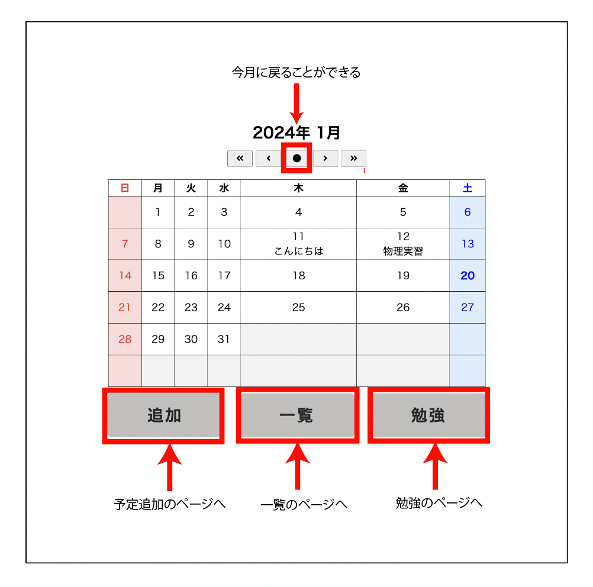
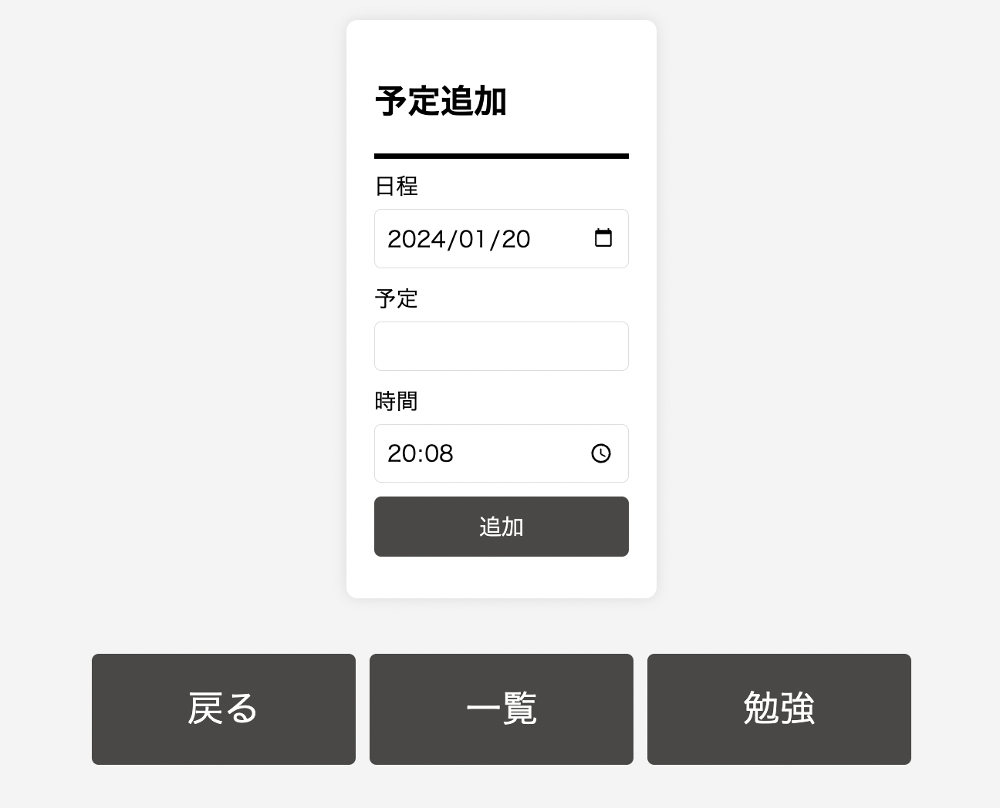
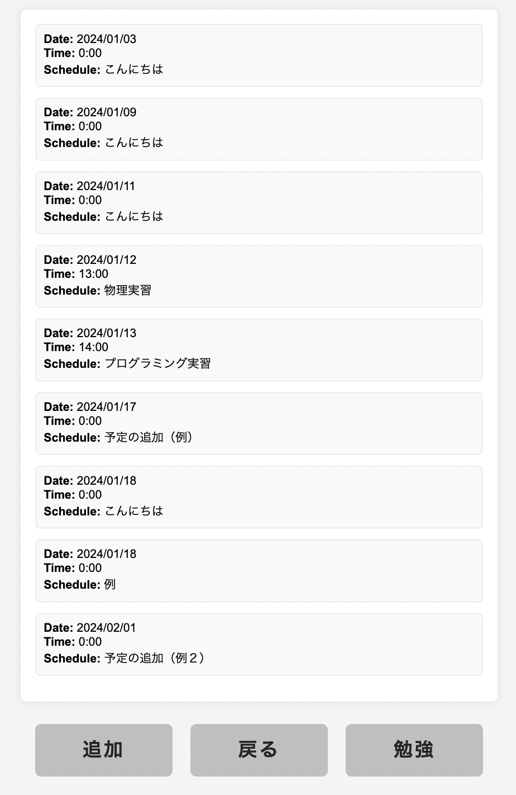
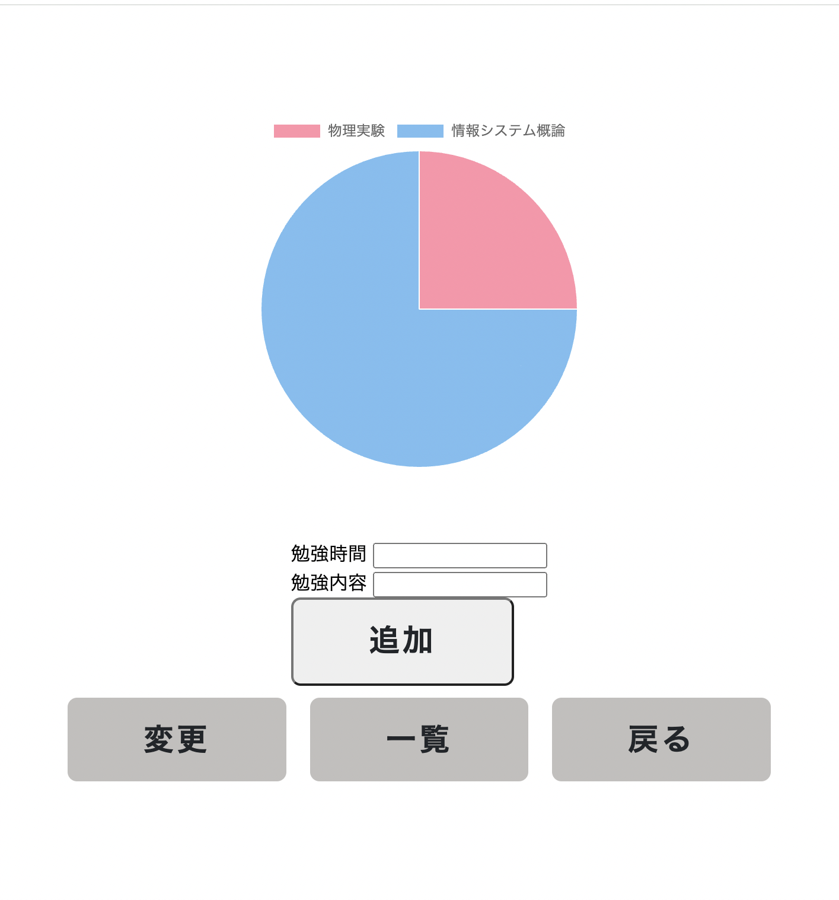

# スタカレ
GUIアプリ用のリポジトリ

## 役割分担
| 役割     | 氏名      | 学籍番号     | 作業内容   |状況   |
| -------------- | -------------- | ----------- | ----------- | ----------- |
|リーダー |柴田悠仁 |k22065 | pull requestの認証、適宜サポート、発表資料の作成 | 待機中 |
| WEB | -------------- | ----------- | ----------- | ----------- |
|カレンダー作成 |横井聡 |K22144 | Html、Css、JavaSJavaScriptでのカレンダー作成 | 完成 |
|カレンダーの表示 |藤田勇輝  |K22112 | Jsonファイルからの予定の表示 | 作業中。 |
|一覧ページの実装 |竹本弥生 |k22083 | Html,追加ページへの移動 | 進捗ゼロ |
|予定の追加ページの実装 |杉山怜央 |K21069 | Html,追加ボタンが押された時の処理 | 作業中 |
| python | -------------- | ----------- | ----------- | ----------- |
|予定の追加実装 |柴田翔空 |k22064 | 予定一覧に予定を追加する | 修正依頼中 |
|予定の削除 |後藤啓輔 |K22054 | 予定一覧から予定を消去する | web待ち |
|追加機能の実装 |村山颯真 |K22135 | 勉強時間の記録 | 作業中 |

## 動作説明
▫️カレンダー表示画面
- 画面中央にカレンダーが表示されている
- カレンダー内に予定が表示される
- 下、三つのボタンで予定の追加、一覧、勉強のページへと飛べる
<br>


▫️予定の追加画面
- 日程、予定、時間の部分を選択し、予定の追加を行える
<br>


▫️予定の一覧画面
- 登録した予定を一覧で見ることができる
- 予定を日程、時間、スケジュールで検索することができる
<br>


▫️勉強時間の画面
- 勉強時間の登録ができる
- 勉強時間を円グラフで見ることができる
<br>


## ディレクトリの構造
```
- **[GUI_APP]**
  - **[app_images]**
    - オブジェクト演習GUIアプリ案＿柴田.pdf
    - カレンダー.png
    - 勉強時間.jpg
    - 予定の追加.jpg
    - 予定一覧.jpg
  - **[module]**
    - add.py（追加のモジュール）
    - Delete.py（削除のモジュール）
    - study.py（勉強時間のモジュール）
  - **[static]**
  - **[css]**
    - AddSchedule.css（追加ページのCSS）
    - index.css（カレンダーのCSS）
    - list.css（一覧のCSS）
  - **[javascript]**
    - AddSchedule.js（追加ページのJS）
    - index.js（カレンダーのJS）
    - list.js（一覧ページのJS）
  - **[templates]**
    - AddSchedule.html（追加ページのHTML）
    - index.html（カレンダーのHTML）
    - list.html（予定一覧のHTML）
    - study.html（勉強ページのHTML）
  - k00000_12.md（12回報告書のテンプレート）
  - k00000_13.md（13回報告書のテンプレート）
  - main.py（Flask側のプログラム）
  - README.md
  - schedule.json（スケジュールのデータ）
```
